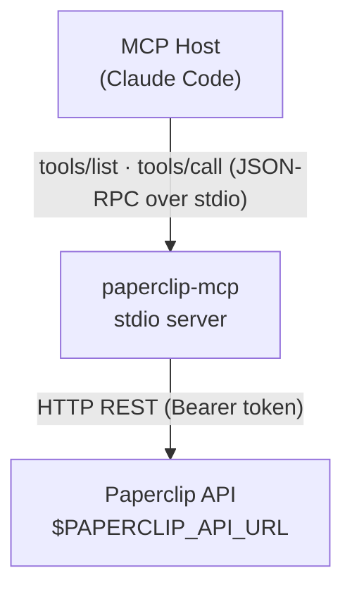

# Architecture Overview

## Purpose

Paperclip MCP is a thin adapter that translates [Model Context Protocol](https://modelcontextprotocol.io) tool calls into HTTP requests against the Paperclip control plane REST API. It runs as a stdio MCP server and is consumed by Claude Code (or any other MCP host).

## System diagram

```
┌──────────────────────────────────────┐
│              MCP Host                │
│  (Claude Code / other MCP client)    │
└──────────────┬───────────────────────┘
               │ MCP stdio (JSON-RPC)
               │ tools/list · tools/call
┌──────────────▼───────────────────────┐
│         paperclip-mcp server         │
│                                      │
│  src/index.ts       — entry point    │
│  src/tools/index.ts — registry       │
│  src/tools/*.ts     — handlers       │
│  src/client.ts      — HTTP client    │
│  src/auth.ts        — auth config    │
│  src/errors.ts      — error type     │
└──────────────┬───────────────────────┘
               │ HTTP/HTTPS
               │ Authorization: Bearer <token>
               │ X-Paperclip-Run-Id: <run-id>
┌──────────────▼───────────────────────┐
│      Paperclip control plane API     │
│         ($PAPERCLIP_API_URL)         │
└──────────────────────────────────────┘
```



## Key modules

### `src/index.ts` — Entry point

Creates the MCP `Server` instance with `{ capabilities: { tools: {} } }`, delegates tool registration to `registerAllTools`, and connects the stdio transport. On fatal error the process exits with code 1.

### `src/tools/index.ts` — Tool registry

Owns the `ToolDefinition` and `ToolAnnotations` interfaces:

```ts
interface ToolAnnotations {
  readOnlyHint?: boolean; // true → tool never modifies state
  destructiveHint?: boolean; // true → tool may have irreversible side-effects
  idempotentHint?: boolean; // true → repeated calls with same args are safe
  openWorldHint?: boolean; // true → tool may interact with external services
}

interface ToolDefinition {
  name: string;
  description: string;
  inputSchema: Record<string, unknown>; // JSON Schema passed to the MCP host
  annotations?: ToolAnnotations; // optional MCP 1.5 behavioural hints
  handler: (args: unknown, client: PaperclipClient) => Promise<ToolResult>;
}
```

Annotations are forwarded to the MCP host in `tools/list` responses, allowing hosts to surface safety warnings or restrict dangerous tools. All read-only tools set `readOnlyHint: true`; write tools set `destructiveHint` and `openWorldHint` appropriately.

`registerAllTools` builds a `Map<name, ToolDefinition>` from the `ALL_TOOLS` array (populated by tool modules) and registers two MCP request handlers:

| Handler                  | MCP schema   | What it does                                                                              |
| ------------------------ | ------------ | ----------------------------------------------------------------------------------------- |
| `ListToolsRequestSchema` | `tools/list` | Returns `name`, `description`, `inputSchema`, and `annotations` for every registered tool |
| `CallToolRequestSchema`  | `tools/call` | Looks up the tool by name, calls its `handler`, returns `ToolResult`                      |

An unknown tool name raises `McpError(ErrorCode.MethodNotFound)`.

### `src/tools/*.ts` — Tool handlers

Each file exports an array of `ToolDefinition` objects. Tool groups:

| Module           | Tools                                                                                                                                                                                                                                                                                        |
| ---------------- | -------------------------------------------------------------------------------------------------------------------------------------------------------------------------------------------------------------------------------------------------------------------------------------------- |
| `identity.ts`    | `paperclip_get_me`, `paperclip_get_inbox`                                                                                                                                                                                                                                                    |
| `issues.ts`      | `paperclip_list_issues`, `paperclip_get_issue`, `paperclip_get_heartbeat_context`, `paperclip_checkout_issue`, `paperclip_release_issue`, `paperclip_update_issue`, `paperclip_create_issue`                                                                                                 |
| `comments.ts`    | `paperclip_list_comments`, `paperclip_add_comment`                                                                                                                                                                                                                                           |
| `documents.ts`   | `paperclip_list_documents`, `paperclip_get_document`, `paperclip_upsert_document`                                                                                                                                                                                                            |
| `agents.ts`      | `paperclip_list_agents`                                                                                                                                                                                                                                                                      |
| `dashboard.ts`   | `paperclip_get_dashboard`                                                                                                                                                                                                                                                                    |
| `approvals.ts`   | `paperclip_list_approvals`, `paperclip_get_approval`, `paperclip_create_approval`, `paperclip_approve`, `paperclip_reject`, `paperclip_request_revision`, `paperclip_resubmit_approval`, `paperclip_list_approval_comments`, `paperclip_add_approval_comment`, `paperclip_create_agent_hire` |
| `goals.ts`       | `paperclip_list_goals`, `paperclip_get_goal`, `paperclip_create_goal`, `paperclip_update_goal`                                                                                                                                                                                               |
| `projects.ts`    | `paperclip_list_projects`, `paperclip_get_project`, `paperclip_create_project`, `paperclip_update_project`, `paperclip_list_workspaces`, `paperclip_create_workspace`, `paperclip_update_workspace`                                                                                          |
| `activity.ts`    | `paperclip_get_activity`, `paperclip_get_cost_summary`, `paperclip_get_costs_by_agent`, `paperclip_get_costs_by_project`                                                                                                                                                                     |
| `routines.ts`    | `paperclip_list_routines`, `paperclip_get_routine`, `paperclip_create_routine`, `paperclip_update_routine`, `paperclip_add_routine_trigger`, `paperclip_update_routine_trigger`, `paperclip_delete_routine_trigger`, `paperclip_run_routine`, `paperclip_list_routine_runs`                  |
| `attachments.ts` | `paperclip_list_attachments`, `paperclip_upload_attachment`, `paperclip_download_attachment`, `paperclip_delete_attachment`                                                                                                                                                                  |

### `src/tools/validation.ts` — Shared helpers

Central module imported by every tool handler. Exports:

| Export           | Purpose                                                                                    |
| ---------------- | ------------------------------------------------------------------------------------------ |
| `validate`       | Parses args with a Zod schema; throws `McpError(InvalidParams)` on failure                 |
| `handleApiError` | Converts `PaperclipApiError` → `{ isError: true }` result; re-throws all other error types |
| `NoInput`        | Zod schema for tools with no parameters                                                    |
| `IssueIdSchema`  | Zod schema for `{ issueId: string }`                                                       |
| `StatusSchema`   | Zod enum of valid issue status values                                                      |
| `PrioritySchema` | Zod enum of valid priority values                                                          |

### `src/client.ts` — `PaperclipClient`

Typed HTTP wrapper around the global `fetch`. Constructed once in `registerAllTools` and shared across all handler calls.

Key behaviours:

- Reads credentials from `getAuthConfig()` at construction time.
- `buildHeaders()` always injects `Authorization: Bearer <apiKey>` and `Content-Type: application/json`. When a `runId` is available (from env or the optional per-call argument), it also injects `X-Paperclip-Run-Id`.
- `handleResponse<T>()` parses JSON on 2xx, returns `undefined` on 204/empty, and throws `PaperclipApiError` on any non-ok status.

```
PaperclipClient
├── get<T>(path)
├── post<T>(path, body?, runId?)
├── patch<T>(path, body, runId?)
├── put<T>(path, body, runId?)
└── delete<T>(path, runId?)
```

### `src/auth.ts` — Auth config

Reads and validates five environment variables at startup:

| Variable               | Required | Purpose                                |
| ---------------------- | -------- | -------------------------------------- |
| `PAPERCLIP_API_KEY`    | yes      | Short-lived JWT injected per run       |
| `PAPERCLIP_API_URL`    | yes      | Base URL for the control plane         |
| `PAPERCLIP_AGENT_ID`   | yes      | Identity of the running agent          |
| `PAPERCLIP_COMPANY_ID` | yes      | Company scope for all requests         |
| `PAPERCLIP_RUN_ID`     | no       | Current heartbeat run ID (audit trail) |

Missing required variables throw at startup, not at first API call.

### `src/errors.ts` — Error type

`PaperclipApiError` extends `Error` and captures `status`, `statusText`, and the raw response `body`. Tool handlers propagate this as a `ToolResult` with `isError: true` so the MCP host sees a structured error rather than an unhandled exception.

## Authentication flow

```
Paperclip runtime
      │
      ├─ injects PAPERCLIP_API_KEY (short-lived JWT per run)
      ├─ injects PAPERCLIP_AGENT_ID, PAPERCLIP_COMPANY_ID
      ├─ injects PAPERCLIP_API_URL
      └─ injects PAPERCLIP_RUN_ID  ← ties HTTP mutations to the audit trail

paperclip-mcp (at startup)
      │
      └─ src/auth.ts reads + validates all vars
            │
            └─ PaperclipClient stores them in-memory
                  │
                  └─ Every HTTP request → Authorization: Bearer <JWT>
                                          X-Paperclip-Run-Id: <runId>  (mutations)
```

The API key is a **run-scoped JWT** issued by the Paperclip runtime and valid only for the current heartbeat. It is never written to disk by this server. When the heartbeat ends, the token expires.

`X-Paperclip-Run-Id` is included on all mutating requests (`POST`, `PATCH`, `PUT`, `DELETE`). The Paperclip API uses it to link each change to the originating run for traceability. Read requests (`GET`) do not require it.

## MCP protocol integration

The MCP SDK handles the JSON-RPC framing over stdio. The server declares a single capability — `tools` — and registers handlers for the two tool-related message types:

**`tools/list`** — sent by the host on startup. The registry maps `ALL_TOOLS` to `{ name, description, inputSchema }` tuples and returns them. The host uses `inputSchema` (JSON Schema) to know what arguments each tool accepts.

**`tools/call`** — sent by the host when the agent invokes a tool. Payload: `{ name, arguments }`. The registry:

1. Looks up `name` in `toolMap`. Unknown name → `McpError(MethodNotFound)`.
2. Calls `tool.handler(arguments, client)`.
3. The handler uses `validateInput` / `validate` (Zod) to parse `arguments`. Bad input → `McpError(InvalidParams)`.
4. The handler calls `PaperclipClient`, gets a response, and returns `ToolResult`.
5. The SDK serialises the result back over stdio.

All tool results share the shape:

```ts
{ content: [{ type: "text", text: string }], isError?: boolean }
```

## Error handling strategy

| Layer               | Error type                 | How it surfaces                                                                     |
| ------------------- | -------------------------- | ----------------------------------------------------------------------------------- |
| Argument validation | `McpError(InvalidParams)`  | Thrown by `validate()`; re-thrown by `handleApiError`; SDK returns a JSON-RPC error |
| Unknown tool name   | `McpError(MethodNotFound)` | Raised in the registry dispatcher                                                   |
| HTTP 4xx/5xx        | `PaperclipApiError`        | Caught by `handleApiError`; returned as `{ isError: true, content: [...] }`         |
| Startup / config    | `Error` (plain)            | Thrown by `getAuthConfig`; caught in `main()`, logged to stderr, process exits 1    |
| Unhandled fatal     | any                        | `main().catch(...)` logs and exits 1                                                |

Handlers follow the pattern:

```ts
import { validate, handleApiError } from "./validation.js";

async handler(args, client) {
  try {
    const input = validate(Schema, args);
    const data = await client.get<unknown>(path);
    return { content: [{ type: "text", text: JSON.stringify(data) }] };
  } catch (err) {
    return handleApiError(err); // PaperclipApiError → isError result; McpError → re-thrown
  }
}
```

`handleApiError` (from `src/tools/validation.ts`) converts `PaperclipApiError` into a structured `{ isError: true }` tool result so the MCP host can reason about the failure. Any other error type (including `McpError`) is re-thrown and handled by the SDK.

## Adding a new tool (step-by-step)

1. **Create or open a tool module** under `src/tools/`. Group related tools in one file (e.g. `src/tools/projects.ts`).

2. **Define input schema** with Zod:

```ts
import { z } from "zod";

const ListProjectsInput = z.object({
  status: z.string().optional(),
});
```

3. **Write the tool definition:**

```ts
import type { ToolDefinition } from "./index.js";
import { validate, handleApiError } from "./validation.js";

export const projectTools: ToolDefinition[] = [
  {
    name: "paperclip_list_projects",
    description: "List projects for the current company.",
    inputSchema: {
      type: "object",
      properties: {
        status: { type: "string", description: "Filter by status" },
      },
      required: [],
    },
    async handler(args, client) {
      try {
        const input = validate(ListProjectsInput, args);
        const params = new URLSearchParams();
        if (input.status) params.set("status", input.status);
        const qs = params.toString();
        const data = await client.get<unknown>(
          `/api/companies/${client.companyId}/projects${qs ? `?${qs}` : ""}`
        );
        return { content: [{ type: "text", text: JSON.stringify(data) }] };
      } catch (err) {
        return handleApiError(err);
      }
    },
  },
];
```

4. **Register the tool group** in `src/tools/index.ts`:

```ts
import { projectTools } from "./projects.js";

const ALL_TOOLS: ToolDefinition[] = [
  ...identityTools,
  ...issueTools,
  ...commentTools,
  ...documentTools,
  ...projectTools, // ← add here
];
```

That's it. No changes to `src/index.ts` or any other file are needed.

5. **Add tests** (optional but recommended): see existing `*.test.ts` files for the pattern — construct a `PaperclipClient` with a mock `fetchFn` and assert the tool's handler output.

## Extension points

| What to change                          | Where                                                                        |
| --------------------------------------- | ---------------------------------------------------------------------------- |
| Add new tools                           | `src/tools/<module>.ts` + `ALL_TOOLS` in `src/tools/index.ts`                |
| Switch transport (stdio → HTTP/WS)      | `src/index.ts` — swap `StdioServerTransport`                                 |
| Add auth schemes (OAuth, token refresh) | `src/auth.ts` and `src/client.ts`                                            |
| Richer error responses                  | Catch `PaperclipApiError` in handlers and return structured `isError` result |

## Related

- [MCP tools reference](../reference/tools.md)
- [Getting started guide](../guides/getting-started.md)
- [Configuration](../guides/configuration.md)
